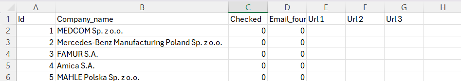
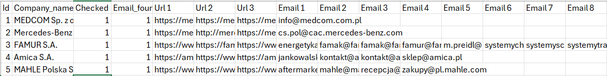

# EmailScraper

EmailScraper is a Python-based tool that extracts email addresses from company URLs using regex. It leverages web scraping techniques to gather URLs from DuckDuckGo and then scrapes emails from those URLs.

## Features

- Extracts company URLs from DuckDuckGo search results.
- Scrapes email addresses from the extracted URLs.
- Supports proxy usage for requests.
- Handles various exceptions and errors during the scraping process.
- Saves the results to a CSV file.

## Requirements

- Python 3.x
- `requests`
- `beautifulsoup4`
- `pandas`
- `python-dotenv`

## Installation

1. Clone the repository:

   ```sh
   git clone https://github.com/yourusername/EmailScraper.git
   cd EmailScraper
   ```

2. Install the required packages:

   ```sh
   pip install -r requirements.txt
   ```

3. Create a `.env` file in the root directory and add your SmartProxy credentials:

   ```env
   USERNAME_SMARTPROXY=your_username
   PASSWORD_SMARTPROXY=your_password
   ```

4. Prepare the necessary input files:
   - `headers.txt`: Contains headers for the requests.
   - `keywordsUrl.txt`: Contains keywords to exclude from URLs.
   - `keywordsEmail.txt`: Contains keywords to exclude from emails.
   - `CompaniesEmails.csv`: Contains the list of companies to scrape emails for.

## Usage

Run the main script:

```sh
python main.py
```

Press `CTRL+Q` to stop the process.

## Example

Csv file before running the program


Program running


Csv file after running the program



## Backup

Backups are saved in the `backup` directory with the filename format CompaniesEmailsBackup\_[datetime].csv.

## Logging

Logs are saved in the `logs` directory with the filename format my*app*[datetime].log.

## License

This project is licensed under the MIT License.
